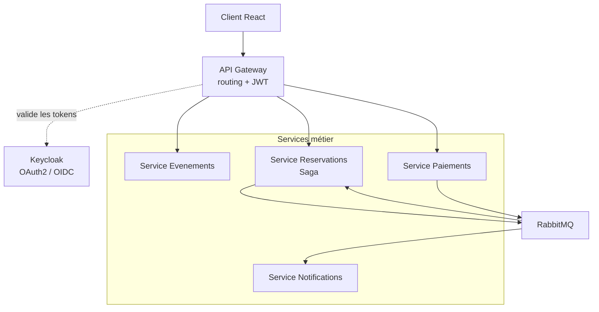
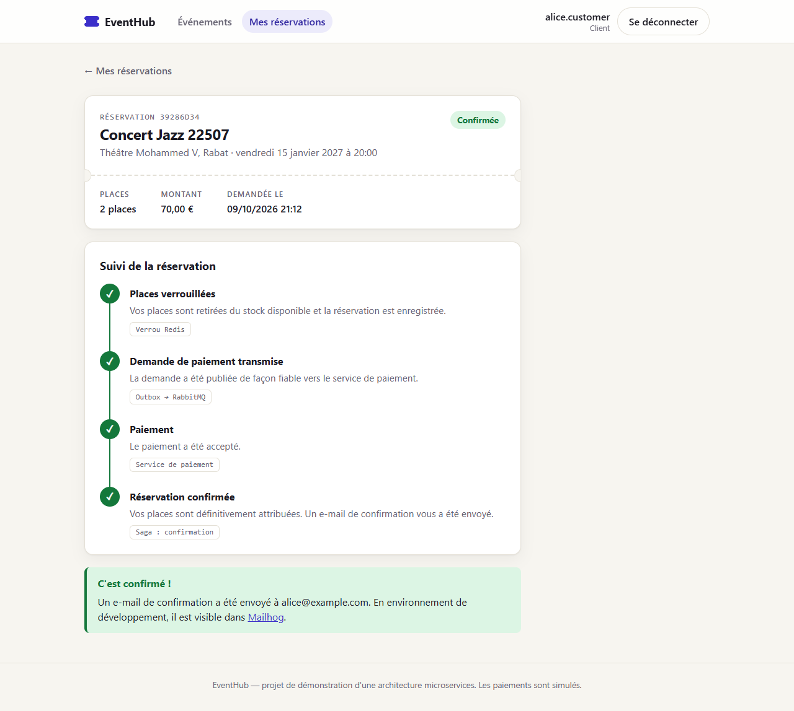

# EventHub

Plateforme de reservation de billets pour evenements (concerts, conferences, sport), construite comme un ensemble de microservices Spring Boot avec un frontend React.

Projet pense pour mettre en pratique — et pouvoir argumenter en entretien — une architecture microservices realiste : authentification centralisee (Keycloak), communication asynchrone (RabbitMQ), Saga avec compensation, et un pipeline CI/CD complet.

> Le detail des exigences fonctionnelles et techniques est dans [`CAHIER_DES_CHARGES.md`](./CAHIER_DES_CHARGES.md).

## Sommaire

- [Architecture](#architecture)
- [Stack technique](#stack-technique)
- [Demarrage rapide](#demarrage-rapide)
- [Structure du projet](#structure-du-projet)
- [Roadmap](#roadmap)
- [Patterns mis en oeuvre](#patterns-mis-en-oeuvre)
- [Tests](#tests)
- [Licence](#licence)

## Architecture



Chaque service métier possède sa **propre base de données** (pattern *database per service*) et ne communique avec les autres que via des **événements RabbitMQ** ou via le Gateway pour les appels synchrones depuis le frontend.

## Stack technique

| Couche | Choix |
|---|---|
| Backend | Java 21, Spring Boot 3, Spring Cloud Gateway |
| Sécurité | Keycloak (OAuth2 / OIDC), Spring Security Resource Server |
| Messaging | RabbitMQ |
| Données | PostgreSQL (une instance par service), Redis (verrou de places) |
| Frontend | React 18, TypeScript, Vite, React Query, react-oidc-context |
| Tests | JUnit 5, Mockito, Testcontainers, Vitest |
| CI/CD | GitHub Actions, Docker |

## Demarrage rapide

**Prérequis** : Docker & Docker Compose, Java 21, Maven, Node.js 18+.

```bash
# 1. Lancer toute l'infrastructure (Postgres x3, RabbitMQ, Keycloak, Redis, Mailhog)
docker compose up -d

# 2. Lancer chaque service backend dans son terminal :
#    gateway, event-service, booking-service, payment-service, notification-service
cd services/event-service
mvn spring-boot:run

# 3. Lancer le frontend
cd frontend
cp .env.example .env
npm install
npm run dev
```

Le parcours de démonstration (comptes, étapes, chemin d'échec) est décrit dans le
[README du frontend](./frontend/README.md).



Interfaces utiles en local :

| Outil | URL |
|---|---|
| Frontend | http://localhost:5173 |
| Gateway | http://localhost:8080 |
| Keycloak admin | http://localhost:8081 (admin / admin) |
| RabbitMQ management | http://localhost:15672 (guest / guest) |
| Mailhog (emails capturés) | http://localhost:8025 |

Utilisateurs de test (realm `eventhub` déjà importé) :

| Username | Mot de passe | Rôle |
|---|---|---|
| alice.customer | password | CUSTOMER |
| bob.organizer | password | ORGANIZER |

## Structure du projet

```
eventhub/
├── docker-compose.yml          infra locale complete
├── keycloak/realm-export.json  realm pre-configure (roles, client, users de test)
├── services/
│   ├── gateway/                Spring Cloud Gateway + securite JWT
│   ├── event-service/          catalogue d'evenements (CRUD fonctionnel)
│   ├── booking-service/        reservations, verrou Redis, outbox, orchestration de la Saga
│   ├── payment-service/        paiement simule idempotent, outbox
│   └── notification-service/   emails de confirmation/annulation (Mailhog), deduplication Redis
└── frontend/                   React + Vite + TypeScript
```

Les quatre services metier, le Gateway et le frontend sont fonctionnels et documentes dans leur propre `README.md`.

## Roadmap

- [x] Infrastructure Docker Compose (Postgres x3, RabbitMQ, Keycloak, Redis, Mailhog)
- [x] Gateway avec validation JWT
- [x] Service Evenements (CRUD + sécurité par rôle)
- [x] Service Réservations : verrou Redis + table outbox
- [x] Service Paiements : mock + idempotence
- [x] Saga orchestrée Réservation → Paiement → Confirmation (+ compensation)
- [x] Service Notifications : email de confirmation/échec
- [x] Frontend : parcours de réservation complet, dashboard organisateur
- [ ] Tests d'intégration Testcontainers sur chaque service
- [ ] Pipeline CI/CD GitHub Actions (build, tests, images Docker)
- [ ] Observabilité (Actuator, tracing, dashboards)

Détail complet de chaque lot dans le [cahier des charges](./CAHIER_DES_CHARGES.md).

## Patterns mis en oeuvre

- **Database per service** — chaque service est propriétaire de ses données.
- **Saga orchestrée** — le service Réservations pilote le flux et déclenche les actions compensatoires en cas d'échec de paiement.
- **Outbox pattern** — publication fiable des événements sans double-écrit DB/broker.
- **Idempotence** — clé d'idempotence sur les paiements, déduplication à la consommation des messages.
- **Resource server découplé** — chaque service valide lui-même son JWT (pas de session partagée), Keycloak reste la seule source de vérité sur l'identité.

## Tests

- Unitaires : JUnit 5 + Mockito sur la logique métier de chaque service.
- Intégration : Testcontainers (Postgres, RabbitMQ réels) — voir `event-service` pour un premier exemple à dupliquer.
- Frontend : Vitest sur la logique pure (étapes de la Saga, rôles, formulaires) ; pas encore de test de composants ni d'E2E automatisé.

## Licence

MIT — voir [`LICENSE`](./LICENSE).
