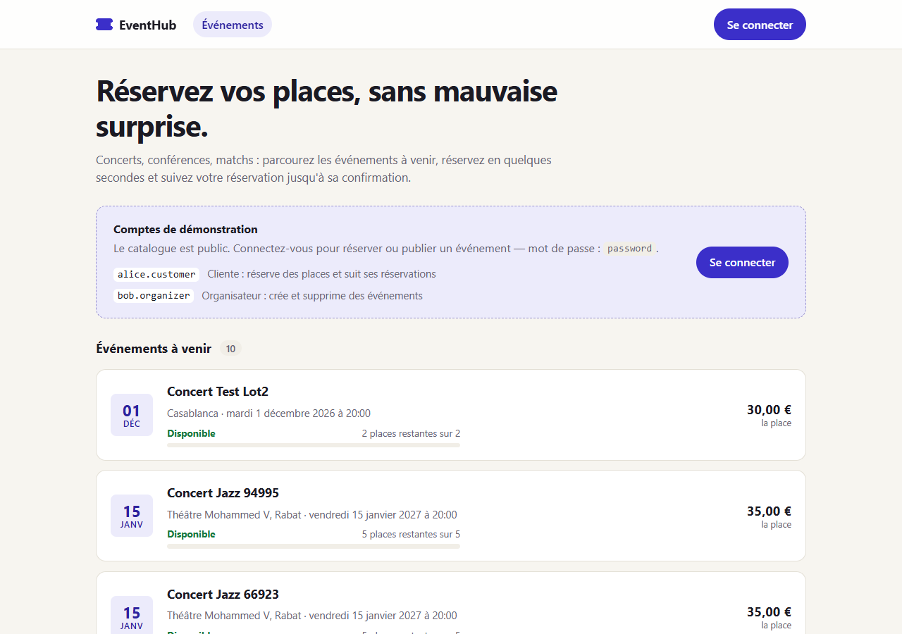
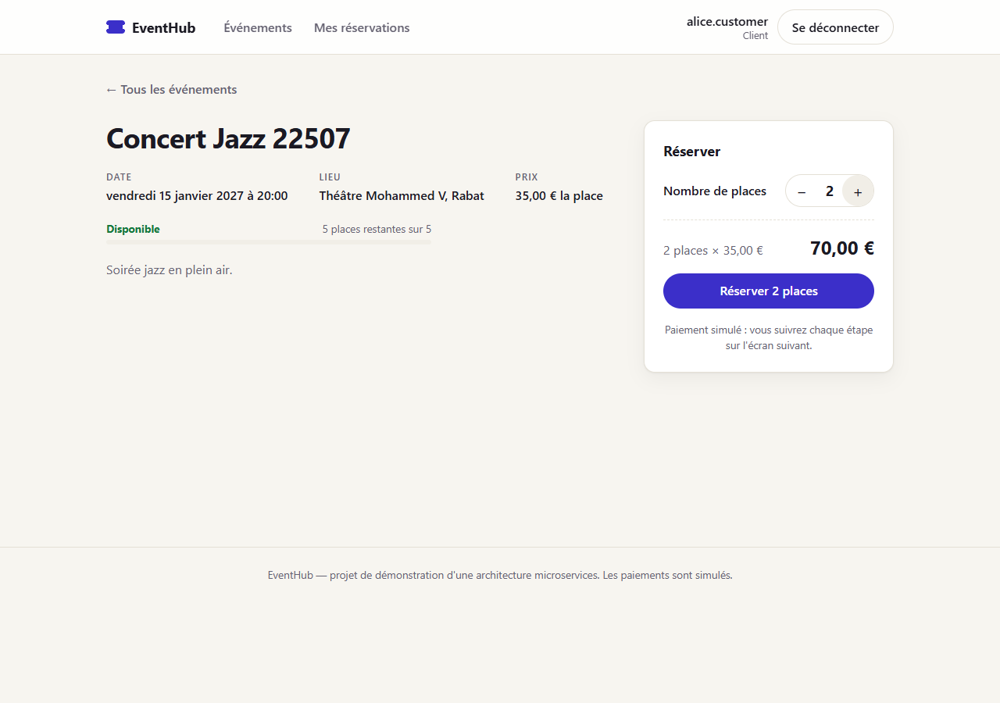
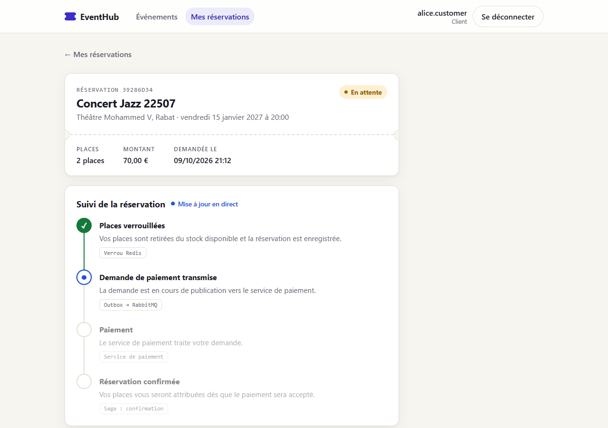
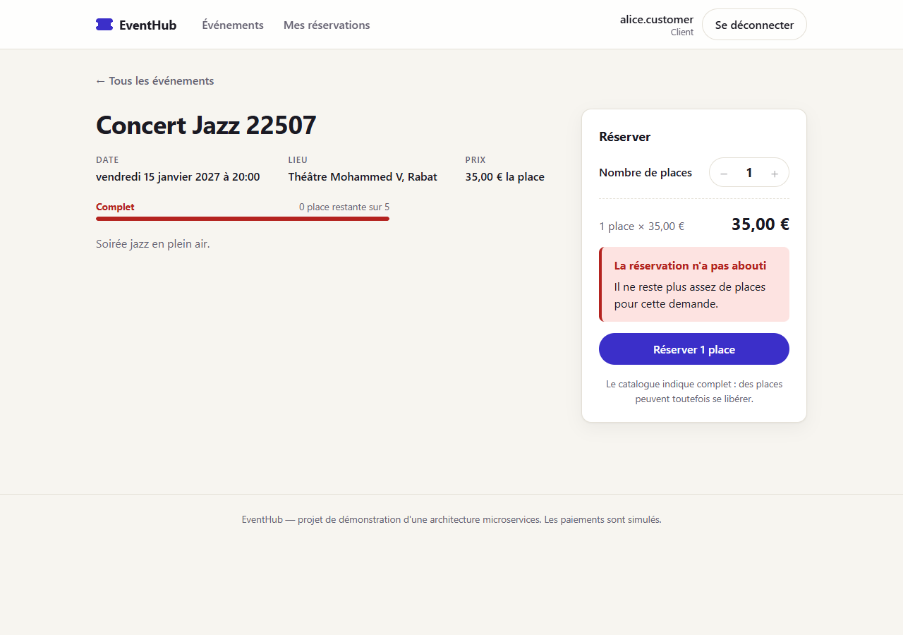
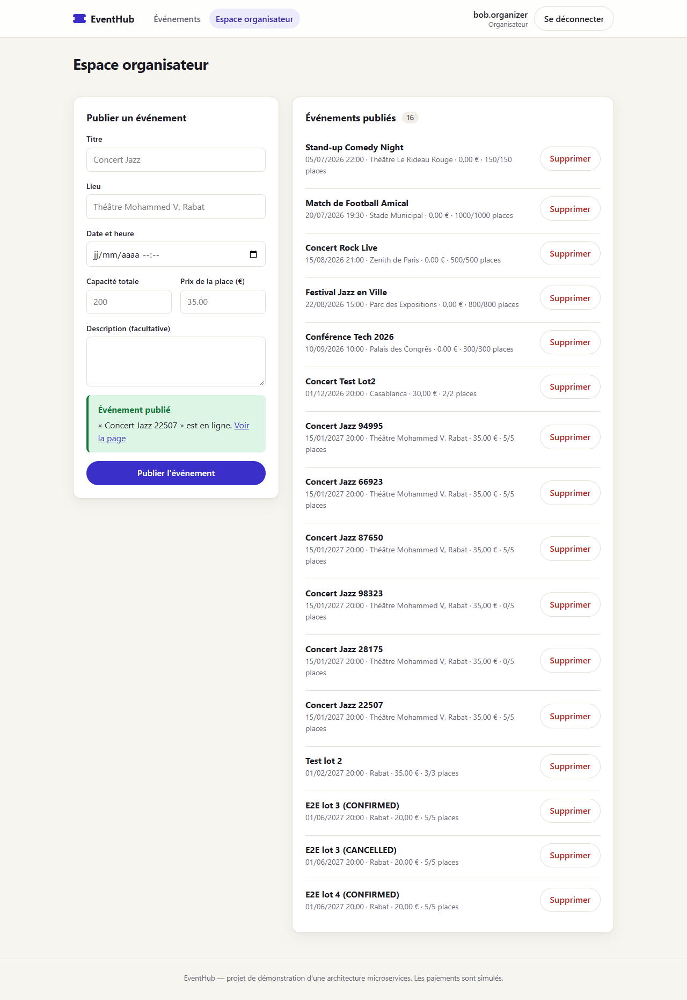

# frontend

Interface web d'EventHub : catalogue public, réservation avec suivi en direct, espace
organisateur. React 18, TypeScript, Vite, React Query et react-oidc-context.

- **Port** : 5173
- **API** : tout passe par le Gateway (`http://localhost:8080`)
- **Authentification** : Keycloak, Authorization Code + PKCE

État : **lot 5 terminé**.

## Écrans

| Route | Accès | Contenu |
|---|---|---|
| `/` | public | Catalogue : événements à venir et passés, jauge de places, prix (FE-1) |
| `/events/:id` | public | Détail d'un événement et panneau de réservation |
| `/bookings/:id` | connecté | Suivi d'une réservation, étape par étape (FE-3) |
| `/bookings` | rôle `CUSTOMER` | Mes réservations, avec leur statut |
| `/organizer` | rôle `ORGANIZER` | Publication et suppression d'événements (FE-4) |

| | |
|---|---|
|  |  |
|  |  |
|  |  |

## Ce que l'interface donne à voir

L'interface sert un client, mais elle est aussi pensée pour rendre visible ce que fait
l'architecture derrière.

- **La Saga, étape par étape.** L'écran de suivi découpe la réservation en quatre étapes
  et nomme la brique qui porte chacune : *Verrou Redis* → *Outbox → RabbitMQ* → *Service
  de paiement* → *Saga : confirmation* ou *compensation*. En cas d'échec de paiement, la
  dernière étape montre l'action compensatoire : places restituées, aucun débit.
- **L'asynchronisme.** Une réservation est créée `PENDING` et l'écran se met à jour seul
  jusqu'à `CONFIRMED` ou `CANCELLED`. Rien n'est bloqué en attendant le paiement.
- **Le stock limité.** Chaque événement affiche une jauge de remplissage (« Disponible »,
  « Dernières places », « Complet »). Réserver une place de trop affiche le refus du
  booking-service.
- **Les rôles.** Le menu et les écrans changent selon le rôle porté par le jeton. Le
  compte connecté et son rôle sont toujours visibles dans l'en-tête.
- **La notification.** Une réservation confirmée renvoie vers Mailhog, où l'e-mail est
  consultable.

## Authentification (FE-2)

`react-oidc-context` gère le flux Authorization Code + PKCE avec le client public
`eventhub-frontend` : aucun secret n'est embarqué dans le navigateur.

- Au retour de Keycloak, l'URL est nettoyée et l'utilisateur revient **sur la page d'où il
  venait** (par exemple l'événement qu'il voulait réserver).
- La déconnexion ferme aussi la **session Keycloak** (`signoutRedirect`). Se contenter
  d'oublier le jeton reconnecterait aussitôt le même utilisateur sans mot de passe, ce qui
  empêcherait de passer d'un compte à l'autre.
- Les rôles sont lus dans le claim `realm_access.roles` du jeton d'accès.

> Masquer un bouton n'est pas une mesure de sécurité. Les rôles lus côté navigateur ne
> servent qu'à choisir quoi afficher ; chaque service revérifie le JWT et les rôles, et un
> appel direct à l'API serait refusé de la même façon.

## Suivi du statut (FE-3)

Le statut est obtenu par **polling** : `GET /api/bookings/{id}` toutes les secondes tant
que la réservation n'est pas dans un état terminal, puis plus rien. La liste « Mes
réservations » se rafraîchit de la même façon tant qu'une réservation est en cours.

L'API n'expose que le statut courant, pas l'historique : les étapes passées sont déduites
de la machine à états du booking-service, dont l'ordre est garanti (`src/lib/saga.ts`).

## Structure

```
src/
├── api/         appels HTTP (client, événements, réservations) et messages d'erreur
├── auth/        session OIDC (useSession) et garde d'affichage (Protected)
├── components/  en-tête, carte d'événement, jauge, badge de statut, frise de la Saga
├── lib/         logique pure et testée : étapes de la Saga, formats, jeton, formulaire
├── pages/       un fichier par écran
└── styles.css   feuille de style unique, thème clair et sombre
```

Aucune bibliothèque de composants : une seule feuille de style, avec des variables CSS.
Le thème suit le réglage clair / sombre du système et la mise en page s'adapte au mobile.

## Configuration

Copier `.env.example` vers `.env` :

| Variable | Défaut | Rôle |
|---|---|---|
| `VITE_API_BASE_URL` | `http://localhost:8080` | Gateway |
| `VITE_KEYCLOAK_AUTHORITY` | `http://localhost:8081/realms/eventhub` | Realm Keycloak |
| `VITE_KEYCLOAK_CLIENT_ID` | `eventhub-frontend` | Client public |
| `VITE_MAILHOG_URL` | `http://localhost:8025` | Lien vers les e-mails capturés |

## Lancer

```bash
# depuis la racine du dépôt : toute l'infrastructure
docker compose up -d

# dans cinq terminaux : gateway, event-service, booking-service, payment-service,
# notification-service
cd services/<service> && mvn spring-boot:run

cd frontend
cp .env.example .env
npm install
npm run dev
```

Puis ouvrir http://localhost:5173.

### Parcours de démonstration

Comptes du realm importé (mot de passe `password`) : `alice.customer` (cliente) et
`bob.organizer` (organisateur).

1. Sans connexion : parcourir le catalogue.
2. Se connecter avec `bob.organizer`, publier un événement de 5 places, se déconnecter.
3. Se connecter avec `alice.customer`, réserver 2 places : l'écran de suivi passe de
   « En attente » à « Confirmée ».
4. Revenir sur l'événement : il reste 3 places. Ouvrir Mailhog pour voir l'e-mail.
5. Réserver les 3 dernières places, puis en demander une de plus : la réservation est
   refusée.

Pour voir le chemin de **compensation**, relancer payment-service avec
`--payment.failure-rate=1.0` : la réservation passe à « Annulée » et l'étape finale
indique que les places ont été restituées.

## Tests

```bash
npm test        # Vitest
npm run build   # vérification TypeScript + build de production
```

34 tests unitaires sur la logique pure : étapes de la Saga selon le statut, lecture des
rôles dans le jeton, validation du formulaire organisateur, disponibilité d'un événement,
messages d'erreur de l'API.

## Limites connues

- Les composants React n'ont pas de tests automatisés, et il n'y a pas de test de bout en
  bout dans le dépôt : le parcours complet a été vérifié dans un navigateur, à la main.
- Le motif d'une annulation (paiement refusé ou délai dépassé) n'est pas exposé par l'API :
  l'écran de suivi reste générique sur ce point.
- Tout organisateur peut supprimer l'événement d'un autre (limite de l'event-service).
- Les places restantes du catalogue sont mises à jour de façon asynchrone et ne comptent
  que les réservations confirmées : une place affichée peut être refusée à la réservation.
